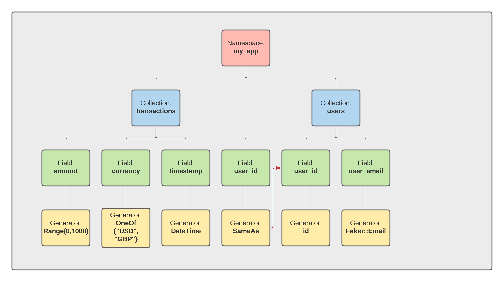

The `schema` is the core data structure that you need to understand to become a Synth wizard.

It's a little involved, so let's start with a simpler example, JSON!

### JSON

If you've never actually seen how JSON is implemented under the hood, you may find this interesting.

One of the reasons for JSON's popularity is just how simple of a data structure it is. JSON is a recursive data structure (just a tree but let's pretend we're smart) and can be defined in 8 lines of code (if you're wondering, this is Rust's `enum` notation):

```rust
enum Value {
    Null,                       // null
    Bool(bool),                 // true
    Number(Number),             // 42
    String(String),             // "Synth"
    Array(Vec<Value>),          // [0, true, "a", ...]
    Object(Map<String, Value>), // { "name" : "Cynthia", "age" : 42 }
}
```

So every node in a JSON tree, is one of 6 variants. Recursion occurs where `Array`s and `Object`s can have children which are also one of 6 variants.

We've based the Synth schema on the same design. But, what does this look like when you need to capture far more complexity than the JSON schema?


### Synth Content Nodes

Much like the `Value` node in a JSON tree, the `Content` nodes in the synth Schema give us the recursive data structure which Synth can use to generate data.

```rust
enum Content {
    Null,
    Bool(BoolContent),
    Number(NumberContent),
    String(StringContent), // here
    Array(ArrayContent),
    Object(ObjectContent),
    SameAs(SameAsContent),
    OneOf(OneOfContent),
}
``` 

Each of these `Content` variants, cover a bunch of different types of `Content` nodes, just to give an example, the `StringContent` variant looks like this under the hood:

```rust
enum StringContent {
    Pattern(RegexContent),
    DateTime(DateTimeContent),
    Categorical(Categorical<String>),
    Faker(FakerContent),
}
```

Where `String` types can be generated from regular expressions, date time generators and so on. For a comprehensive list see the [String](content/string.md) docs.

### Writing Synth Schemas

`Content` nodes have different fields depending on the type of node. This makes sense, if you are generating `id`s, you're going to want to specify different parameters to if you are generating `String::DateTime`s.

However, all `Content` nodes follow a similar template.

- There is a boolean `optional` field, which tells Synth if a field is nullable or not.
- Next there is a `type` field, which specifies which top-level `Content` type the node is (`String`, `Number`, `Bool` etc.). Fields can often have a `subtype` which disambiguates certain types (for example is a `Number` a float `f64` or an unsigned integer `u64`.)
- Finally, `Content` nodes can have 0 or more fields which are specific to that node type. For more information refer to the documentation for that type.

```json
{
  "optional": false,
  "type": "number",
  "subtype": "f64",
  "range": {
    "low": 274.4,
    "high": 6597.5,
    "step": 0.1
  }
}
```

### An example Schema

In our example schema we have a namespace `my_app` which has 2 collections - `transactions` and `users`.

Below is a tree representation of the schema content tree:



The corresponding namespace can be broken into 2 collections.

`transactions`:

```json
{
    "type": "array",
    "length": {
        "type": "number",
        "subtype": "u64",
        "range": {
            "low": 1,
            "high": 6,
            "step": 1
        }
    },
    "content": {
        "type": "object",
        "amount": {
            "optional": false,
            "type": "number",
            "subtype": "f64",
            "range": {
                "low": 0,
                "high": 1000,
                "step": 0.01
            }
        },
        "currency": {
            "type": "one_of",
            "variants": [
                {
                    "type": "string",
                    "pattern": "USD"
                },
                {
                    "type": "string",
                    "pattern": "GBP"
                }
            ]
        },
        "timestamp": {
            "type": "string",
            "date_time": {
                "format": "%Y-%m-%dT%H:%M:%S%z",
                "begin": "2000-01-01T00:00:00+0000",
                "end": "2020-01-01T00:00:00+0000"
            }
        },
        "user_id": {
            "type": "same_as",
            "ref": "users.content.user_id"
        }
    }
}
```

And the `users` collection:

```json
{
    "type": "array",
    "length": {
        "type": "number",
        "subtype": "u64",
        "range": {
            "low": 1,
            "high": 6,
            "step": 1
        }
    },
    "content": {
        "type": "object",
        "user_id": {
            "type": "number",
            "subtype": "u64",
            "id": {
                "start_at": 0
            }
        },
        "user_email": {
            "type": "string",
            "faker": {
                "generator": "email"
            }
        }
    }
}
```
